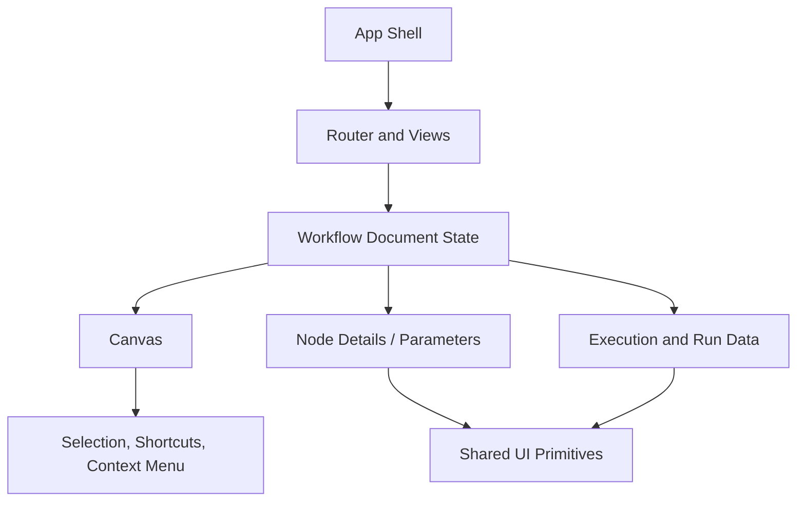

# Frontend Architecture Overview

The n8n frontend is best understood as a layered product rather than a single monolithic screen. The editor shell, the workflow document model, the canvas system, the node configuration experience, and the shared UI layer each play a distinct role.

## Core Layers

1. Application shell
   - Bootstraps Vue, routing, Pinia, and shared plugins.
   - Provides the base chrome: sidebar, routes, global overlays, and app-wide utilities.

2. Workflow domain layer
   - Centers on the workflow document store and related composables.
   - Represents nodes, connections, groups, execution state, and editor-specific view state.

3. Interaction layer
   - Includes the canvas, NDV, node creator, context menu, and command palette.
   - Converts user intent into workflow operations such as selection, duplication, grouping, and execution.

4. Shared UI layer
   - Comes from the design-system package and shared frontend infrastructure.
   - Supplies reusable controls, layout primitives, icons, toasts, tooltips, and accessibility helpers.

## Why This Structure Works

The architecture keeps the editor modular while preserving a coherent workflow model. The route-driven shell hosts different experiences, but the workflow document remains the common backbone. This makes it possible for multiple interfaces—canvas, node configuration, execution panels, and command surfaces—to share the same underlying workflow state without directly coupling to one another.

## Architectural Character

The editor feels more like a composition of focused subsystems than a traditional CRUD application. Each subsystem owns a specific kind of interaction, and the surrounding infrastructure is responsible for coordination.
